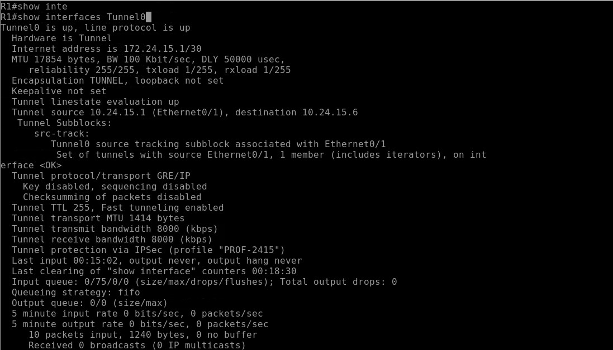
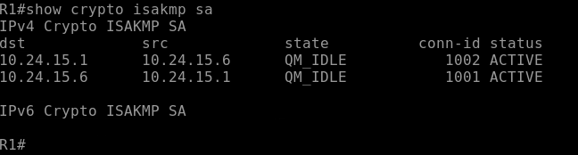
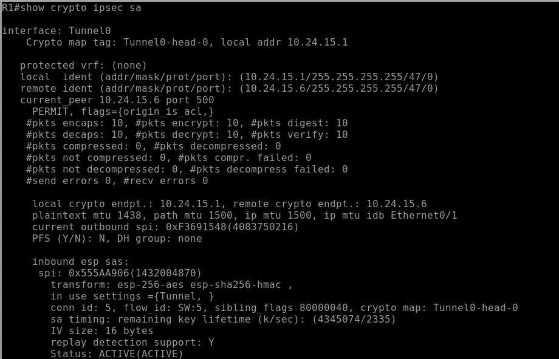
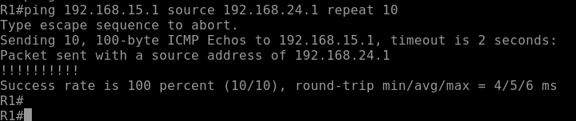

# VPN Site-to-Site IPSec IKEv1 Route-Based

**Estudiante:** Edwin De Paula  
**Matricula:** 2024-2415  
**Institución:** Instituto Tecnológico de las Américas (ITLA)  
**Asignatura:** Seguridad en Redes

---

## Video

| Recurso | URL |
|---|---|
| Video YouTube | https://youtu.be/lpio5H_1HaQ |

---

## Objetivo

Implementar una VPN Site-to-Site basada en enrutamiento utilizando IPSec con IKEv1, estableciendo un túnel virtual (interfaz Tunnel0) entre dos sitios remotos a través de un router ISP. A diferencia de una VPN policy-based, el enrutamiento determina qué tráfico entra al túnel — no una ACL. Esto permite mayor flexibilidad y escalabilidad en la gestión del tráfico cifrado.

---

## Topología


| Dispositivo | Interfaz | Dirección IP | Descripción |
|---|---|---|---|
| R1 | Ethernet0/0 | 192.168.24.1/24 | LAN Site A |
| R1 | Ethernet0/1 | 10.24.15.1/30 | WAN hacia ISP |
| R1 | Tunnel0 | 172.24.15.1/30 | Interfaz de túnel virtual |
| ISP | Ethernet0/0 | 10.24.15.2/30 | WAN hacia R1 |
| ISP | Ethernet0/1 | 10.24.15.5/30 | WAN hacia R2 |
| R2 | Ethernet0/0 | 10.24.15.6/30 | WAN hacia ISP |
| R2 | Ethernet0/1 | 192.168.15.1/24 | LAN Site B |
| R2 | Tunnel0 | 172.24.15.2/30 | Interfaz de túnel virtual |
| PC-A | eth0 | 192.168.24.10/24 | Gateway: 192.168.24.1 |
| PC-B | eth0 | 192.168.15.10/24 | Gateway: 192.168.15.1 |

---

## Parámetros de Configuración

### Fase 1 - IKEv1 (ISAKMP)

| Parámetro | Valor |
|---|---|
| Política | 10 |
| Cifrado | AES 256 |
| Hash | SHA-256 |
| Autenticación | Pre-shared Key |
| Grupo Diffie-Hellman | Grupo 14 (2048 bits) |
| Lifetime | 86400 segundos (24 horas) |
| Pre-shared Key | Edwin2024 |

### Fase 2 - IPSec (Transform Set)

| Parámetro | Valor |
|---|---|
| Nombre | TS-2415 |
| Protocolo | ESP |
| Cifrado | AES 256 |
| Integridad | SHA-256 HMAC |
| Modo | Tunnel |

### IPSec Profile y Tunnel

| Parámetro | Valor |
|---|---|
| Perfil IPSec | PROF-2415 |
| Interfaz Tunnel R1 | Tunnel0 — 172.24.15.1/30 |
| Interfaz Tunnel R2 | Tunnel0 — 172.24.15.2/30 |
| Tunnel Source R1 | Ethernet0/1 (10.24.15.1) |
| Tunnel Source R2 | Ethernet0/0 (10.24.15.6) |
| Tunnel Destination R1 | 10.24.15.6 |
| Tunnel Destination R2 | 10.24.15.1 |

---

## Explicación de la Configuración

### ¿Qué es una VPN Route-Based?

En una VPN basada en enrutamiento, se crea una interfaz de túnel virtual (Tunnel0) que actúa como una interfaz de red normal. El tráfico que debe cifrarse se envía a través de esta interfaz mediante rutas estáticas o dinámicas. La protección IPSec se aplica directamente sobre la interfaz Tunnel mediante un perfil IPSec (`tunnel protection ipsec profile`), sin necesidad de una ACL ni un crypto map.

### Diferencia clave con Policy-Based

| Aspecto | Policy-Based | Route-Based |
|---|---|---|
| ¿Qué define el tráfico cifrado? | ACL | Tabla de ruteo |
| ¿Interfaz virtual? | No | Sí — Tunnel0 |
| ¿Crypto map? | Sí | No |
| ¿Tunnel protection? | No | Sí |

### Flujo de Negociación

1. PC-A genera tráfico hacia 192.168.15.0/24
2. R1 consulta la tabla de ruteo — la ruta apunta a Tunnel0
3. El tráfico entra a la interfaz Tunnel0
4. Tunnel0 tiene `tunnel protection ipsec profile PROF-2415`
5. R1 inicia negociación IKEv1 Fase 1 con R2
6. Se establece la SA de Fase 2 y el tráfico fluye cifrado

---

## Verificación

### Interfaz Tunnel0

```
show interfaces Tunnel0
```



Los campos críticos a verificar son `Tunnel0 is up, line protocol is up` y `Tunnel protection via IPSec (profile "PROF-2415")`.

### ISAKMP SA - Fase 1

```
show crypto isakmp sa
```



El estado `QM_IDLE` con status `ACTIVE` confirma que la Fase 1 se negoció correctamente.

### IPSec SA - Fase 2

```
show crypto ipsec sa
```



Los contadores de paquetes cifrados y descifrados confirman que el tráfico está siendo procesado por el túnel con el transform set `esp-256-aes esp-sha256-hmac` en modo Tunnel.

### Prueba de Conectividad

```
ping 192.168.15.1 source 192.168.24.1 repeat 10
```



100% de success rate confirma el correcto funcionamiento end-to-end de la VPN.

---

## Archivos del Repositorio

```
ipsec-ikev1-route-based/
├── configs/
│   ├── R1.txt
│   ├── ISP.txt
│   └── R2.txt
├── docs/
│   └── screenshots/
│       ├── topology.png
│       ├── tunnel-interface.png
│       ├── isakmp-sa.png
│       ├── ipsec-sa.png
│       └── ping-test.png
└── README.md
```

---

## Herramientas Utilizadas

- PNetLab — Plataforma de emulación de red
- Cisco IOSv 15.4(2)T4 — Imagen de router emulado
- VMware — Virtualización del servidor PNetLab
